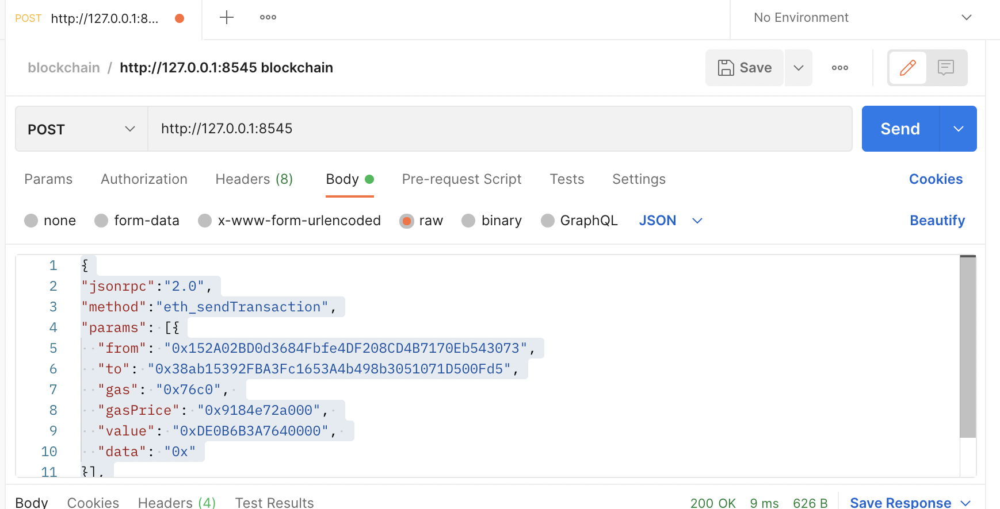

#Como utilizar o Post Man para requisição api json da Ethereum

## 1) Configurar o Postman para localhost usando Ganache: http://127.0.0.1:8545

<p>
    
    
<p>

## 2) Configure o tipo de output para Hex e json:

<p>
    
<p>

- Os Parametros podem ser adicionado no campo abaixo e você pode verificar todos métodos e parametros que a ethereum oferece em <a href="https://eth.wiki/json-rpc/API">Ethereum JsonRPC</a>.
</p>

- Por exemplo : Enviar uma transação pelo postman:

```json
{
  "jsonrpc": "2.0",
  "method": "eth_sendTransaction",
  "params": [
    {
      "from": "0x152A02BD0d3684Fbfe4DF208CD4B7170Eb543073",
      "to": "0x38ab15392FBA3Fc1653A4b498b3051071D500Fd5",
      "gas": "0x76c0",
      "gasPrice": "0x9184e72a000",
      "value": "0xDE0B6B3A7640000",
      "data": "0x"
    }
  ],
  "id": 2
}
```
<h4>OBS: É importante usar valores em hexadecimal.</h4>

